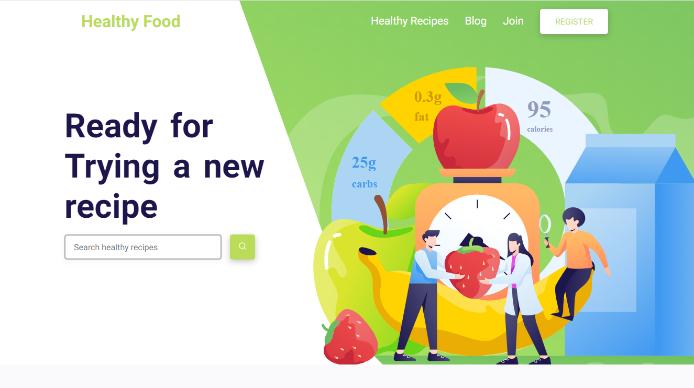
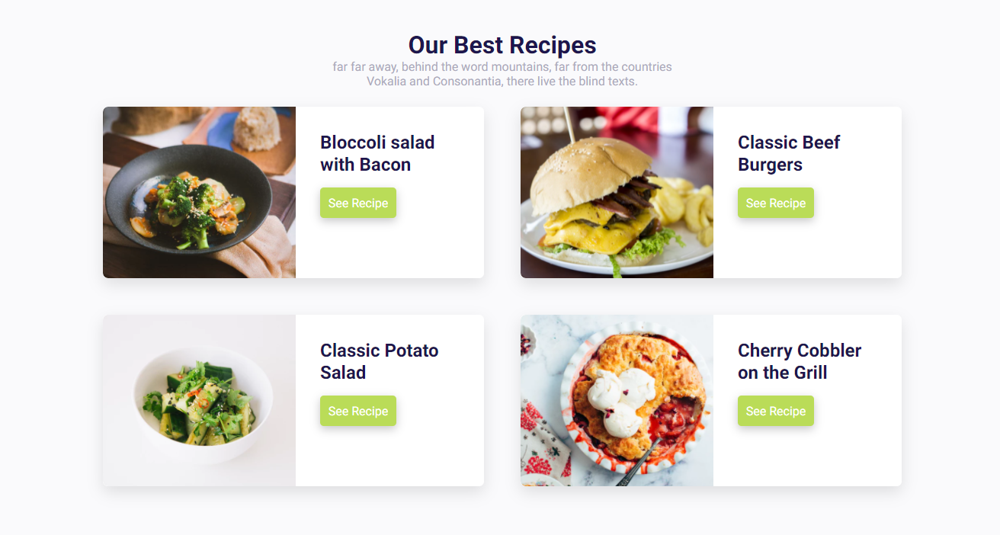
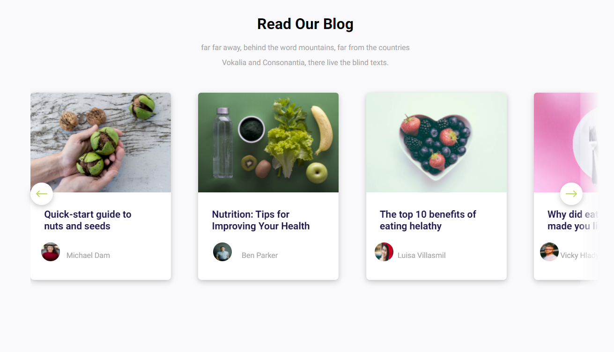
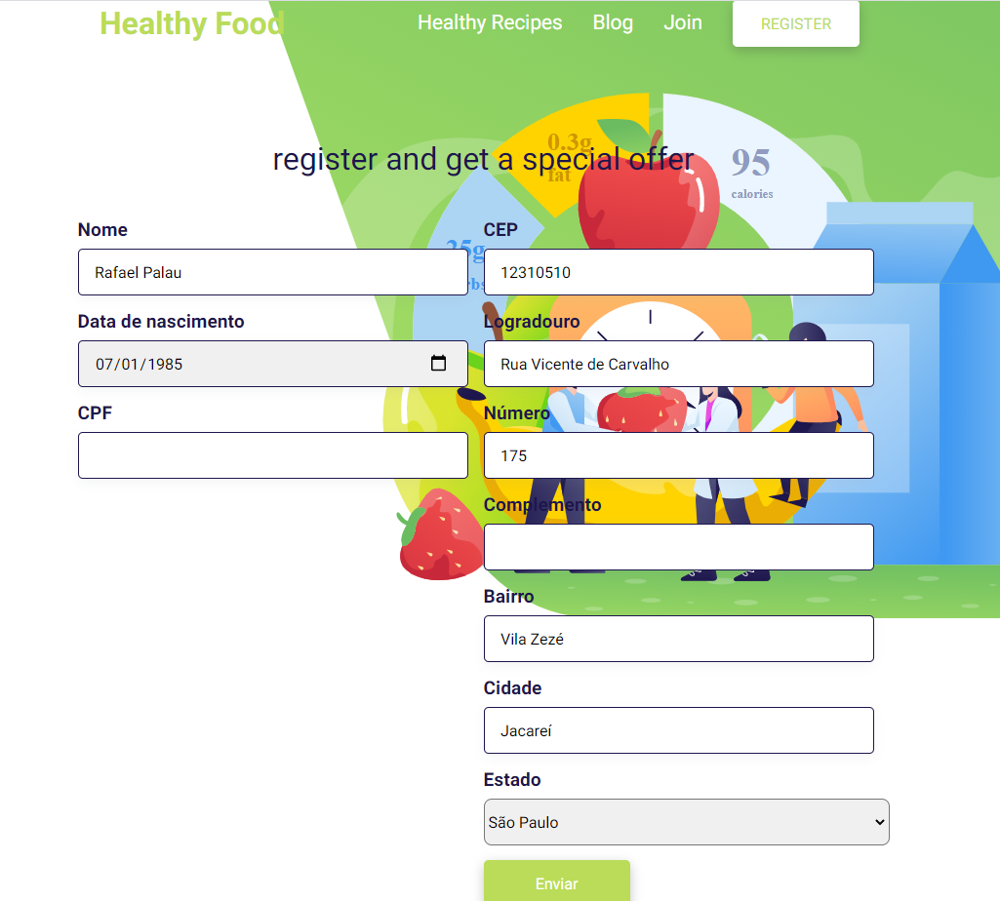

# 

## Summary

- [!](#)
  - [Summary](#summary)
    - [About](#about)
      - [Technologies](#technologies)
    - [Running it Locally](#running-it-locally)
    - [License](#license)
    - [Author](#author)

### About

Develop the website that is attached using a whole structure of React, the website has to be 100% responsive, we will evaluate responsiveness well.

Create a registration screen based on the initial screen, the registration needs to receive the data below:

1. Name
2. Date of birth
3. CPF
4. Zip code
5. Use a post office API to fill in the other fields that make up the address.
6. Validation of fields
7. Store form data in local storage and Cookies

No need to use a database

#### Technologies

2. React - a javascript library
3. Next.js - an extremely powerfull React Framework
4. Typescript - a JavaScript superset that brings data types and other usefull functionalities to JavaScript
5. Sass - 

### Running it Locally

If you wanna run it locally: 

1. clone this repository `git clone https://github.com/RafaPalau/healthy-food`;
2. `cd healthy-food`
3. run `yarn` or `npm install`;
4. run `yarn dev`;

### License

This is a project for a test for a vacancy ... You are restricted to learn from it, copy, edit and ... common, it is a free and open project, you can do ANYTHING you want and it will never change

### Author

### More project images

## 
# 
# 
# 
# 